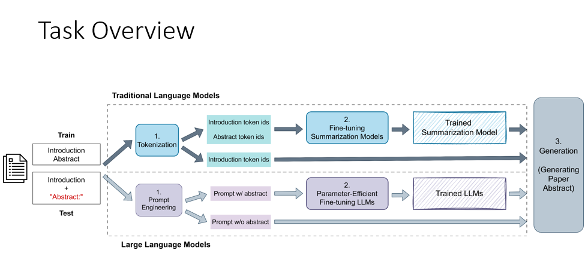

# Paper-Abstract-Generation
113-2 電機所 生成式AI HW2 Paper Abstract Generation

## Author：國立陽明交通大學 資訊管理與財務金融學系財務金融所碩一 313707043 翁智宏

本次是生成式AI課程的第二次作業，是做 Paper Abstract Generation，主要要利用開源的LLM API去針對我們的訓練集進行Fine-tuning，然後對測驗集中的"Intriduction"去進行文章摘要的生成，

然後透過四個評估指標 

- ROUGE-1 (單詞（unigram）層級的重疊)
- ROUGE-2 (雙詞（bigram）層級的重疊)
- ROUGE-L (最長公共子序列（LCS, Longest Common Subsequence）)
- BertScore-1 (使用語意嵌入（BERT embedding）計算語意相似度)

去達到Baseline的設定。

**Questions**
In this homework, we aim to generate paper abstracts from paper introduction bodies. You should try to improve the quality of generated abstract to increase the performance.

## Dataset Description
-  **train.json**: a text file with **408** json lines, where each line represents an individual row of data as follows: **paper_id**: the index of paper. **introduction**: parsed paper introduction in string format.** abstract**: parsed paper abstract in string format.

-  **test.json**: a text file with **103** json lines, where each line represents an individual row of data as follows: **paper_id**: the index of paper.  **introduction**: parsed paper introduction in string format.
  
-  **sample_submission.json**: a sample submission file with 103 json lines, where there is a header and 103 rows of predictions. **paper_id**: the index of paper. **abstract**: parsed paper abstract in string format.

範例：

**introduction**：
"Estimation of quantities defined by the stationary distribution of a Markov chain lies at the heart of many scientific and engineering problems.Famously, the steady-state distribution of a random walk on the World Wide Web provides the foundation of the PageRank algorithm (Langville & Meyer, 2004).In many areas of machine learning, Markov chain Monte Carlo (MCMC) methods are used to conduct approximate Bayesian inference by considering Markov chains whose equilibrium distribution is a desired posterior (Andrieu et al., 2002).An example from engineering is queueing theory, where the queue lengths and waiting time under the limiting distribution have been extensively studied (Gross et al., 2018).As we will also see below, stationary distribution quantities are of fundamental importance in reinforcement learning (RL) (e.g., Tsitsiklis & Van Roy, 1997).Classical algorithms for estimating stationary distribution quantities rely on the ability to sample next states from the current state by directly interacting with the environment (as in on-line RL or MCMC), or even require the transition probability distribution to be given explicitly (as in PageRank).Unfortunately, these classical approaches are inapplicable when direct access to the environment is not available, which is often the case in practice.There are many practical scenarios where a collection of sampled trajectories is available, having been collected off-line by an external mechanism that chose states and recorded the subsequent next states.Given such data, we still wish to estimate a stationary quantity.One important example is off-policy policy evaluation in RL, where we wish to estimate the value of a policy different from that used to collect experience.Another example is off-line PageRank (OPR), where we seek to estimate the relative importance of webpages given a sample of the web graph.Motivated by the importance of these off-line scenarios, and by the inapplicability of classical methods, we study the problem of off-line estimation of stationary values via a stationary distribution corrector.Instead of having access to the transition probabilities or a next-state sampler, we assume only access to a fixed sample of state transitions, where states have been sampled from an unknown distribution and next-states are sampled according to the Markov chain's transition operator.The off-line setting is indeed more challenging than its more traditional on-line counterpart, given that one must infer an asymptotic quantity from finite data.Nevertheless, we develop techniques that still allow consistent estimation under general conditions, and provide effective estimates in practice.The main contributions of this work are:\u2022 We formalize the problem of off-line estimation of stationary quantities, which captures a wide range of practical applications.\u2022 We propose a novel stationary distribution estimator, GenDICE, for this task.The resulting algorithm is based on a new dual embedding formulation for divergence minimization, with a carefully designed mechanism that explicitly eliminates degenerate solutions.\u2022 We theoretically establish consistency and other statistical properties of GenDICE, and empirically demonstrate that it achieves significant improvements on several behavior-agnostic offpolicy evaluation benchmarks and an off-line version of PageRank.The methods we develop in this paper fundamentally extend recent work in off-policy policy evaluation (Liu et al., 2018;Nachum et al., 2019) by introducing a new formulation that leads to a more general, and as we will show, more effective estimation method."

**abstract**：
"In the realm of reinforcement learning and Monte Carlo methods, a formidable challenge looms: the quest to estimate quantities tethered to the stationary distribution of a Markov chain. In the unpredictable landscape of real-world applications, we often find ourselves constrained by a fixed dataset, with no further communion with the environment to glean additional insights. Yet, fear not! We unveil a path forward, demonstrating that consistent estimation is not only feasible but can also yield robust results in critical applications.  Our method hinges on a clever ratio that rectifies the gap between the stationary and empirical distributions, drawing upon the inherent properties of the stationary distribution itself. By deftly employing constraint reformulations grounded in variational divergence minimization, we forge a new algorithm: GenDICE. This approach is not only elegant but also remarkably effective.  We rigorously establish the consistency of our method under broad conditions, accompanied by a comprehensive error analysis that lays bare its strengths. Furthermore, our empirical results shine brightly, showcasing GenDICE's prowess across benchmark tasks, including off-line PageRank and off-policy policy evaluation. In this intricate dance of data and algorithms, we have crafted a tool that promises to illuminate the shadows of uncertainty in estimation."

## 模型介紹
我根據 Task Overvirw.png 分兩種路線去實作此任務：

### 1. Traditional Language Models（摘要三巨頭）

Pegasus、T5 (FLAN-T5)、或 BART 都是最常見的「摘要三巨頭」

我使用了 PEGASUS-Large、PEGASUS-ArXiv、LED 、LongT5，然後最後一版是上傳 **PEGASUS-Large** 版本

### 2. Large Language Models

Gemma3、Qwen 2.5

